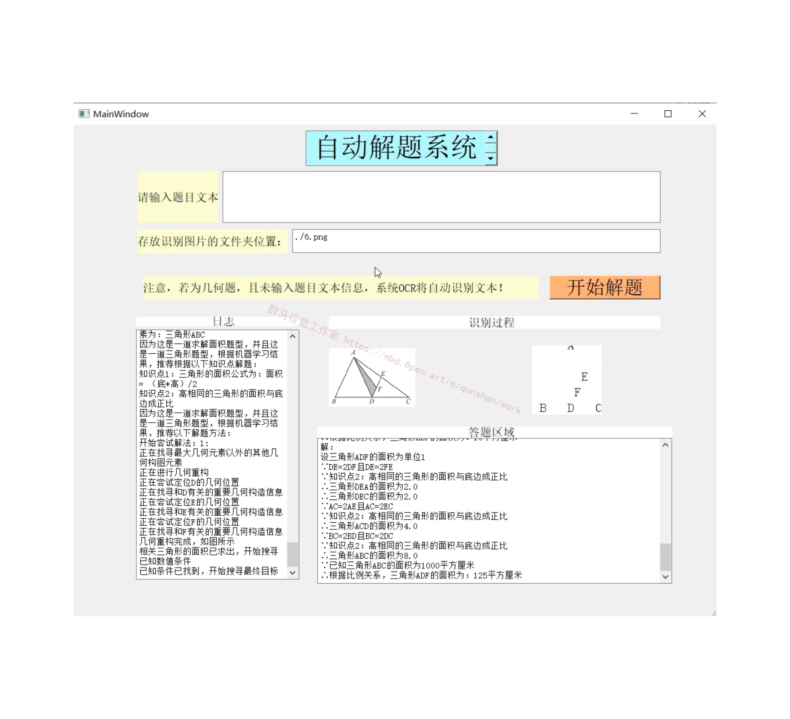
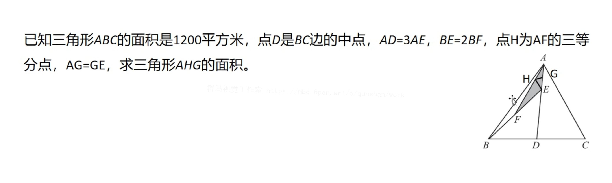

# 1.研究背景
近年来，在高性能计算机设备和互联网背景下海量数据的辅助下，深度学习相关的技术取得了长足的进步，但是随着相关研究的不断涌现，深度学习为代表的的一系列以神经网络为基础的技术也进入了发展的深水区，相比于早期关注于网络结构设计的改进，当前的研究更关注如何完全发挥神经网络的全部性能潜力并探究监督学习之外的学习设定。最近出现的AlphaFold l2在生物学当中的基因序列和蛋白质结构预测发挥出了惊人的性能，延续了监督学习在科学发现上的探索。另外，预训练语言模型BERT[3]及其相关的预训练语言模型技术革新了整个自然语言处理社区的技术，并在计算机视觉[4和数据挖掘I5I等多个领域引发着变革，在机器学习设定上它也扩展了自监督学习的工具包。这些发展固然振奋人心，但是当前的人工智能体是否真的发展到了人们所期许的程度?通常认为现有的人工智能系统在可解释性和外部知识上还面临着很大的挑战。更准确地来说，可解释性困境指代模型的预测往往不可理解切可信度较低，因此当前的模型难以分析和理解其内在工作机理;外部知识困境指代当前模型难以引入现存的外部知识，例如常识知识和知识图谱。

# 2.图片演示
#### 图片扫描输入

#### 题目文本输入

# 3.视频演示
[AI几何＆代数数学题自动答题系统（源码＆教程）_哔哩哔哩_bilibili](https://www.bilibili.com/video/BV1oe411L7Hr/?vd_source=bc9aec86d164b67a7004b996143742dc)

# 4.机器智能推理
#### 基于神经符号推理的方法
[该博客提出的基于符号推理的方法](https://mbd.pub/o/bread/mbd-Y5mTk5lp)和基于概率统计推理的方法都具有很强的抽象性和泛化能力。这类系统具有良好的可解释性，但由于其符号表征技术的局限性和离散性，这类系统系统又往往具有脆弱和难以扩展的特性。相对应的，神经网络模型由于其良好的表征能力，在各种不同的人工智能任务上都实现了最优越的性能。然而，这类模型难以在深度表郑重体现出组合性和泛化性，同时它们也不能提供明确的决策证据来解释它们产生对应输出的原因，这些特性也使得这一类基于神经网络的推理系统看起来像一个黑盒子。因此，一个很直接的思路就是将神经网络模型与符号推理相结合，这在在本文中也被称之为神经符号推理。一般来说，神经符号推理系统将现有的推理技术与基于神经网络的符号表征相结合，以可微模块组合的形式实现推理任务，这里的每个模块都对应着一个具有特定功能的程序。以这样的实现方式构建的系统通常比常规的类似于黑盒的神经网络更易于解释。
比较具有代表性的神经符号推理方法主要有知识图谱推理[37.38]，神经语义解析[39-40]和模块化神经网络。
知识图谱指的是在以概念节点和关系类型边构成的一类图的数据结构，这一类图数据结构实际上是有大量的三元组数据拼接组合而成，知识图谱推理往往指的是继续现有的逻辑事实和关系结构，推理出图中不显式存在的一些知识。例如，在知识图谱中可能有有这样的一些事实:“姚期智-供职于-清华大学，清华大学-位于-中国”，我们可以据此总结出姚期智居住在中国这一事实，这也是一个基于知识图谱事实信息进行推理的例子。在神经符号推理中，这类问题中常常会涉及到深度表征的转移，基于循环网络的链路搜寻，强化学习等技术。

# 5.自注意力网络
[该博客提出的自注意力网络](https://afdian.net/item?plan_id=788701265a8011ed876052540025c377)由于其在并行计算中的灵活性和对长依赖关系建模的能力，在机器翻译[82,83]和自然语言推理等经典自然语言处理任务[84中取得了令人惊叹的效果。它可以通过计算输入序列中元素对之间的注意权重来获取序列之间复杂的关系。该网络[82l的核心之一是自注意力计算模块，称为“标度点积注意”( ScaleDot Product Attention, SDPA)。它也是自注意力网络的基本运算单元。此模块的输入包含查询矩阵o∈ Rmxd、键矩阵K ∈ Rm×d和值矩V∈ Rm×dv，其中m是输入符号单元的数量，d:是单个符号单元对应向量的维度，dv是值向量的维度。输出可通过以下公式计算:

# 6.模型图

# 7.系统整合
[下图源码＆环境部署视频教程＆自定义UI界面](https://s.xiaocichang.com/s/a061f0)

参考[博客《AI几何＆代数数学题自动答题系统（源码＆教程）》](https://zhuanlan.zhihu.com/p/570312787)
# 8.参考文献
[1]张景中,彭翕成,邹宇.几何机器明证引发的思考[D].2020
[2]张景中,李永彬.几何定理机器证明三十年[D].2009
[3]吴文俊.数学机械化研究回顾与展望[J].系统科学与数学.2008,(8).898-904.
[4]王磊.基于深度强化学习的数学应用题自动求解器[D].2019
[5]Zhang, Dongxiang,Wang, Lei,Zhang, Luming,等.The Gap of Semantic Parsing: A Survey on Automatic Math Word Problem Solvers[J].IEEE Transactions on Pattern Analysis and Machine Intelligence.2020,42(9).2287-2305.DOI:10.1109/TPAMI.2019.2914054.
[6]AlQuraishi, Mohammed.AlphaFold at CASP13[J].Bioinformatics.2019,35(22).4862-4865.DOI:10.1093/bioinformatics/btz422.
[7]Domingos, Pedro,Lowd, Daniel.Unifying Logical and Statistical AI with Markov Logic[J].Communications of the ACM.2019,62(7).74-83.DOI:10.1145/3241978.
[8]LeCun Yann,Bengio Yoshua,Hinton Geoffrey.Deep learning[J].Nature.2015,521(7553).436-444.DOI:10.1038/526050a.
[9]JAN WIELEMAKER,TOM SCHRIJVERS,MARKUS TRISKA,等.SWI-Prolog[J].Theory & practice of logic programming.2012,12(Jan.Pt.1).
[10]Anirban Mukherjee,Utpal Garain.A review of methods for automatic understanding of natural language mathematical problems[J].Artificial Intelligence Review: An International Science & Engineering Journal.2008,29(2).
[11]Richardson Matthew,Domingos Pedro.Markov logic networks[J].Machine Learning.2006,62(1-2).107-136.DOI:10.1007/s10994-006-5833-1.
[12]Jacobs, R,Jordan, M,Nowlan, S,等.Adaptive Mixtures of Local Experts[J].Neural Computation.1991,3(1).79-87.
[13]Charles R. Fletcher.Understanding and solving arithmetic word problems: A computer simulation[J].Behavior research methods, instruments & computers.1985,17(5).565-571.
[14]James R. Slagle.Experiments with a deductive question-answering program[J].Communications of the ACM.1965,8 (12).792-798.DOI:10.1145/365691.365960.
[15]Christopher D. Manning,Mihai Surdeanu,John Bauer,等.The Stanford CoreNLP Natural Language Processing Toolkit[C].2014
[16]Nate Kushman,Yoav Artzi,Luke Zettlemoyer,等.Learning to Automatically Solve Algebra Word Problems[C].2014
[17]Mohammad Javad Hosseini,Hannaneh Hajishirzi,Oren Etzioni,等.Learning to Solve Arithmetic Word Problems with Verb Categorization[C].2014
[18]Dan Goldwasser,Dan Roth.Learning from Natural Instructions[C].2011
[19]Ying Zhang,Tao Xiang,Timothy M. Hospedales,等.Deep Mutual Learning[C].
[20]Vlad Adrian Stefanescu,Ion Emilian Radoi.Autonomous Self-Diagnosis System[C].

---
#### 如果您需要更详细的【源码和环境部署教程】，除了通过【系统整合】小节的链接获取之外，还可以通过邮箱以下途径获取:
#### 1.请先在GitHub上为该项目点赞（Star），编辑一封邮件，附上点赞的截图、项目的中文描述概述（About）以及您的用途需求，发送到我们的邮箱
#### sharecode@yeah.net
#### 2.我们收到邮件后会定期根据邮件的接收顺序将【完整源码和环境部署教程】发送到您的邮箱。
#### 【免责声明】本文来源于用户投稿，如果侵犯任何第三方的合法权益，可通过邮箱联系删除。